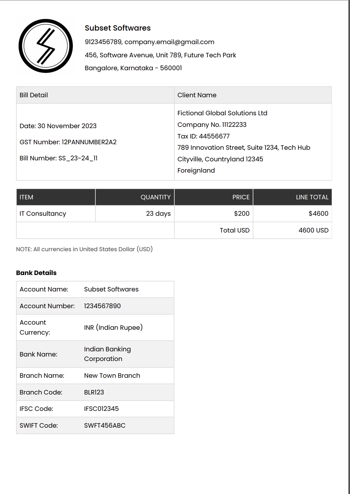

# Invoice Template

To create your invoice, you can simply edit `src/app/data.ts` for company and client details. Also, update the logo url by placing your logo in `public` folder.

## Sample Screenshot



## Getting Started

First, run the development server:

```bash
npm run dev
# or
yarn dev
# or
pnpm dev
# or
bun dev
```

Open [http://localhost:3000](http://localhost:3000) with your browser to see the result.
